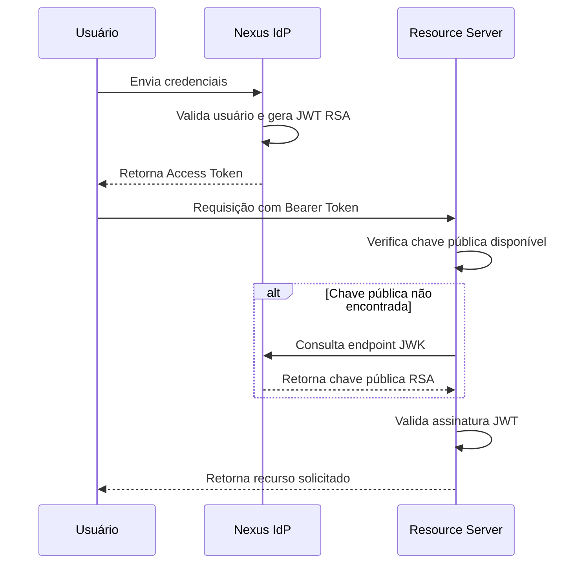
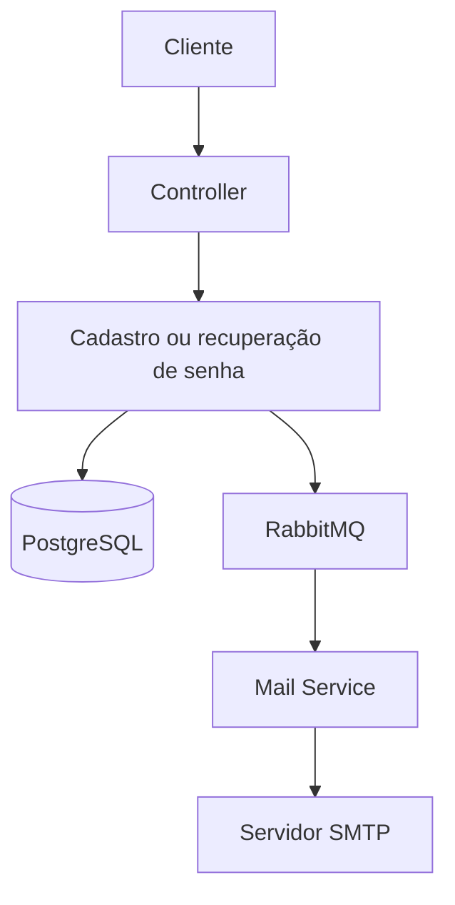

# NEXUS IDENTITY PROVIDER


## ■ Demonstração

[](https://github.com/FernandoPPrado/nexus-identity-provider/raw/main/DemoVideo.mp4)

> 💡 **Dica:** Clique na imagem acima para baixar e assistir ao vídeo de demonstração da aplicação em funcionamento.


> Um Identity Provider (IdP) desenvolvido para explorar arquitetura, segurança e boas práticas de engenharia de software em aplicações Java modernas.

## O Dilema da Autenticação

Todo desenvolvedor backend, em algum momento, se depara com a mesma pergunta ao iniciar um novo ecossistema de aplicações:

**Como gerenciar a identidade e a segurança dos usuários?**

Geralmente, as opções se dividem em dois extremos:

1. **O Extremo Simplista (Basic Auth / JWT com chave simétrica):** Rápido de implementar e suficiente para muitas aplicações isoladas. No entanto, à medida que o ecossistema cresce, compartilhar a mesma chave secreta entre múltiplos serviços aumenta o acoplamento e amplia o impacto de um eventual comprometimento. Além disso, funcionalidades como recuperação de senha, confirmação de e-mail, bloqueio de usuários e gerenciamento de credenciais acabam sendo reimplementadas em cada novo projeto.

2. **O Extremo Completo (Keycloak, Auth0, ZITADEL):** Soluções maduras, robustas e amplamente utilizadas em ambientes corporativos. Em contrapartida, podem representar uma complexidade adicional para projetos menores, exigindo infraestrutura dedicada e uma curva de aprendizado considerável quando apenas uma parte de seus recursos será utilizada.

## Onde o Nexus se encaixa?

O **Nexus Identity Provider** foi desenvolvido para ocupar esse meio-termo. Ele não busca substituir soluções consolidadas como **Keycloak**, **Auth0** ou **ZITADEL** em ambientes corporativos, mas oferecer uma alternativa enxuta para projetos menores, além de servir como um projeto de referência para o estudo de arquitetura, segurança e engenharia de software.

O objetivo nunca foi apenas "fazer um login", mas compreender como um Identity Provider funciona internamente, implementando conceitos presentes em soluções modernas, como autenticação baseada em criptografia assimétrica (JWT RSA), endpoint JWK, arquitetura multi-tenant, mensageria assíncrona, proteção contra abusos e boas práticas de engenharia.

Mais do que um sistema de autenticação, o Nexus representa a implementação prática de um serviço de identidade completo, explorando conceitos presentes em arquiteturas modernas de backend.

---

## ■ Stack Tecnológica Completa

| Categoria | Tecnologias |
|-----------|-------------|
| Linguagem | Java 21 |
| Framework | Spring Boot 3 |
| Segurança | Spring Security • JWT (RSA) • Nimbus JOSE JWT • BCrypt |
| Persistência | Spring Data JPA • Hibernate • PostgreSQL |
| Mensageria | RabbitMQ (Spring AMQP) |
| Cache | Caffeine |
| Rate Limiting | Bucket4j |
| Documentação | SpringDoc OpenAPI (Swagger UI) |
| Observabilidade | Spring Boot Actuator • SLF4J • Logback |
| Testes | JUnit 5 • Mockito • MockMvc • AssertJ • H2 Database |
| Infraestrutura | Docker • Docker Compose • Caddy • Oracle Cloud Infrastructure (OCI) |

---

## ■ Decisões de Arquitetura

### 1. Desempenho e Concorrência: Java 21 & Virtual Threads

Serviços de autenticação podem se tornar pontos de alta concorrência em uma arquitetura distribuída. Utilizando **Virtual Threads (Project Loom)**, a aplicação consegue lidar com um grande volume de operações concorrentes com menor custo de memória em comparação ao modelo tradicional baseado em threads de plataforma.

Essa abordagem permite maior eficiência em cenários com operações bloqueantes, reduzindo a necessidade de escalonamento horizontal causado apenas por limitações de concorrência.

### 2. Segurança Descentralizada: JWT + RSA + JWK

Ao invés de utilizar uma chave simétrica compartilhada entre múltiplos serviços, o Nexus utiliza **criptografia assimétrica baseada em RSA** para assinatura dos tokens JWT.

- O Identity Provider mantém exclusivamente a chave privada responsável pela assinatura.
- Os Resource Servers obtêm a chave pública através do endpoint JWK, permitindo validar tokens localmente sem depender de chamadas constantes ao servidor de autenticação.

Essa abordagem reduz acoplamento entre serviços, facilita a distribuição de confiança e segue o modelo utilizado por diversos provedores modernos de identidade.

### 3. Resiliência e Desacoplamento: RabbitMQ

O envio de e-mails é tratado de forma assíncrona utilizando mensageria.

Após operações como cadastro ou recuperação de senha, a aplicação publica um evento no RabbitMQ. Um consumidor dedicado processa esse evento e realiza o envio posteriormente, evitando que serviços externos de e-mail impactem diretamente o tempo de resposta das requisições.

Essa separação permite maior resiliência e possibilita estratégias futuras de reprocessamento.

### 4. Proteção contra Abusos: Bucket4j + Caffeine

Endpoints relacionados à autenticação são alvos comuns de tentativas automatizadas e ataques de força bruta.

O projeto implementa **Rate Limiting** utilizando o algoritmo **Token Bucket** através do Bucket4j, mantendo o estado dos limites em cache com Caffeine para garantir baixa latência durante a validação das requisições.

### 5. Arquitetura Multi-Tenant

O banco foi modelado para suportar múltiplos projetos independentes dentro da mesma aplicação.

Ao invés de utilizar apenas o e-mail como identificador único, o sistema utiliza uma restrição composta (`project_id + email`), permitindo que o mesmo endereço de e-mail exista em diferentes organizações sem conflitos.

Essa abordagem garante isolamento lógico entre tenants e evita acessos indevidos entre diferentes projetos.

---

## ■ Fluxos da Aplicação

### Fluxo de Emissão e Validação de Token JWT



### Fluxo Assíncrono de E-mail



## ■ Funcionalidades

- Cadastro de usuários.
- Confirmação de conta através de e-mail.
- Autenticação via JWT assinado com RSA.
- Recuperação de senha através de fluxo seguro por e-mail.
- Soft Delete de usuários.
- Arquitetura Multi-Tenant com isolamento por projeto.
- Endpoint JWK para distribuição da chave pública.
- Rate Limiting para proteção contra abusos.
- Tratamento global de exceções com respostas padronizadas.
- Documentação interativa via Swagger/OpenAPI.

## ■ Endpoints da API

A documentação completa dos endpoints e seus respectivos schemas pode ser testada interativamente através do [Swagger UI](https://nexus-idp.duckdns.org/swagger-ui/index.html).

Servidor de produção: `https://nexus-idp.duckdns.org`

### Autenticação (Auth Controller)

| **Método** | **Endpoint**                  | **Descrição**                                              |
| ---------- | ----------------------------- | ---------------------------------------------------------- |
| **POST**   | `/auth/register`              | Realiza o cadastro de um novo usuário no provedor.         |
| **POST**   | `/auth/login`                 | Autentica o usuário e retorna o token JWT RSA.             |
| **GET**    | `/auth/.well-known/jwks.json` | Exposição da chave pública para validação descentralizada. |

### Gestão de Usuários (User Controller)

| **Método** | **Endpoint**              | **Descrição**                                              |
| ---------- | ------------------------- | ---------------------------------------------------------- |
| **POST**   | `/user/recovery-token`    | Inicia o fluxo de recuperação gerando um token seguro.     |
| **POST**   | `/user/recovery-validate` | Valida o token recebido e efetiva a redefinição de senha.  |
| **POST**   | `/user/confirm-token`     | Gera e envia o token de ativação para o e-mail do usuário. |
| **POST**   | `/user/confirm-validate`  | Valida o token e ativa permanentemente a conta no sistema. |

## ■ Usuário de Demonstração

Para facilitar os testes no Swagger ou no Postman, um usuário de demonstração está pré-configurado no ambiente:

- **E-mail:** `nexus-idp-test2@sharklasers.com`
- **Senha:** `senha123`
- **Project ID:** `11111111-2222-3333-4444-555555555555`

## ■ Links Úteis

- [Repositório](https://github.com/FernandoPPrado/nexus-identity-provider)
- [INSTALL.md](https://www.google.com/search?q=link_aqui)
- [Swagger](https://nexus-idp.duckdns.org/swagger-ui/index.html)

## ■ Instalação

Toda a instalação foi movida para **INSTALL.md**.

## ■ Segurança

O Nexus Identity Provider foi desenvolvido seguindo práticas comuns em arquiteturas modernas de autenticação, buscando reduzir riscos comuns encontrados em implementações próprias de login.

## ■ Assinatura Assimétrica de Tokens JWT

A aplicação utiliza JWT assinado com RSA, separando a responsabilidade de emissão e validação dos tokens.

- A chave privada permanece exclusivamente no Identity Provider.
- A chave pública é disponibilizada através do endpoint JWK.
- Serviços consumidores podem validar tokens localmente sem compartilhar segredos sensíveis.

Essa abordagem reduz o acoplamento entre serviços e evita a distribuição de uma chave secreta única entre múltiplas aplicações.

### Proteção de Credenciais

- Senhas armazenadas utilizando BCrypt.
- Tokens de confirmação e recuperação gerados utilizando `SecureRandom`.
- Validações para evitar sobrescrita indevida de tokens ativos.
- Fluxos de recuperação e confirmação realizados através de eventos assíncronos.

### Controle de Abusos

Endpoints sensíveis, como autenticação e recuperação de senha, possuem proteção contra excesso de requisições através de Rate Limiting.

A implementação utiliza:

- Bucket4j para controle do algoritmo Token Bucket.
- Caffeine Cache para armazenamento eficiente dos limites em memória.

### Isolamento Multi-Tenant

A arquitetura foi projetada considerando múltiplos projetos independentes.

O relacionamento entre usuário e projeto utiliza restrições compostas, garantindo que usuários possam existir em diferentes contextos sem colisões ou acesso indevido entre tenants.

### Exposição de Dados

O sistema evita armazenar informações sensíveis dentro dos tokens JWT.

Os tokens carregam apenas informações necessárias para autenticação e autorização, enquanto dados privados permanecem no servidor responsável pelo armazenamento.

Além disso:

- Cookies de sessão não são utilizados.
- Tokens possuem tempo de expiração configurado.
- Respostas de erro são tratadas por um handler global, evitando exposição de stack traces ou detalhes internos da aplicação.

## ■ Testes

A aplicação conta com uma suíte de testes focada principalmente nas camadas críticas de autenticação, regras de negócio e comportamento dos endpoints, buscando garantir estabilidade e segurança durante a evolução do projeto.

- **Testes de Integração:** Validação dos fluxos completos da aplicação, incluindo regras de negócio, persistência, autenticação, geração de respostas HTTP e tratamento global de exceções.
- **Testes WebMVC:** Utilização de **MockMvc** para validar o comportamento dos controllers, incluindo serialização de payloads, códigos HTTP retornados, validações de entrada e atuação dos handlers de exceção.
- **Banco de testes:** Utilização do **H2 Database** em cenários de testes, permitindo execução isolada sem dependência do ambiente PostgreSQL de produção.

A suíte utiliza:

- JUnit 5
- Mockito
- MockMvc
- AssertJ

Comando para executar os testes localmente:

```bash
./mvnw test

```

## ■ Infraestrutura

O Nexus Identity Provider está preparado para execução utilizando containers Docker e foi disponibilizado em ambiente cloud utilizando **Oracle Cloud Infrastructure (OCI)**.

A arquitetura de infraestrutura utiliza:

- **Docker:** Containerização da aplicação Spring Boot.
- **PostgreSQL:** Banco de dados utilizado em ambiente de produção.
- **RabbitMQ:** Mensageria utilizada para processamento assíncrono de eventos, hospedada como serviço externo.
- **Caddy:** Proxy reverso responsável pelo gerenciamento de tráfego HTTP/HTTPS e certificados TLS automáticos.
- **Oracle Cloud Infrastructure (OCI):** Ambiente de hospedagem da aplicação.

### Arquitetura de Deploy

```text
Internet
   |
   v
Caddy (HTTPS / Reverse Proxy)
   |
   v
Nexus Identity Provider (Spring Boot)
   |
   +---- PostgreSQL

```

A aplicação utiliza HTTPS com certificado TLS válido, garantindo comunicação segura entre clientes e o Identity Provider.

A configuração completa de ambiente, variáveis necessárias e execução através de containers está disponível no arquivo **INSTALL.md**.

## ■ Observabilidade

A aplicação utiliza o **Spring Boot Actuator** para expor endpoints operacionais e de monitoramento.

Através dele, é possível acompanhar:

- Saúde da aplicação através de health checks.
- Status das conexões com recursos externos, como banco de dados e serviços integrados.
- Métricas operacionais da aplicação.
- Informações úteis para diagnóstico em ambientes de produção.

Esses recursos facilitam o acompanhamento do estado do Identity Provider e auxiliam na identificação de problemas durante a operação.

## ■ Aviso de Uso

O Nexus Identity Provider é disponibilizado como software open source sob a licença MIT.

A aplicação fornece uma implementação de referência de um serviço de identidade, porém a responsabilidade pela configuração, segurança operacional, infraestrutura, monitoramento, adequação regulatória e tratamento de dados permanece com quem realiza sua implantação.

Antes de utilizar o sistema em ambientes críticos ou com dados reais, recomenda-se realizar uma análise de segurança e adaptar a solução conforme os requisitos do cenário de uso.

## ■ Licença

Este projeto está licenciado sob a licença **MIT**.

A licença MIT permite uso, modificação e distribuição do código, desde que os termos da licença sejam respeitados.

Consulte o arquivo [LICENSE](https://www.google.com/search?q=LICENSE) para mais detalhes.
